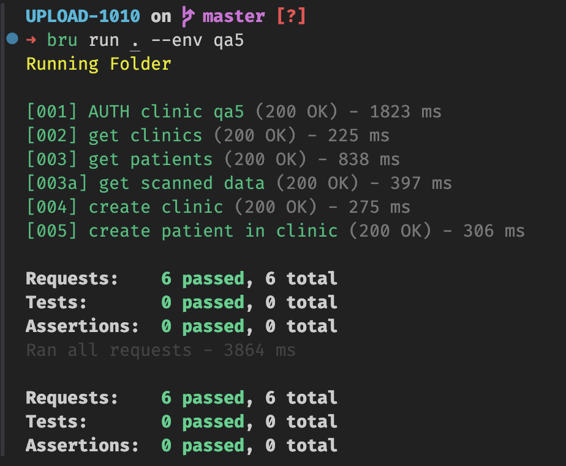

# BRUNO collection for creating new clinic

## Setup
* Create env file `cp .env.example .env`
* Fill env file with auth of clinician

## Execute in UI
* If you want to create new clinic with new patient, run `[001]`, `[004]` and `[005]`

## Execute in CLI
* `bru run . --env qa5`

Example:
